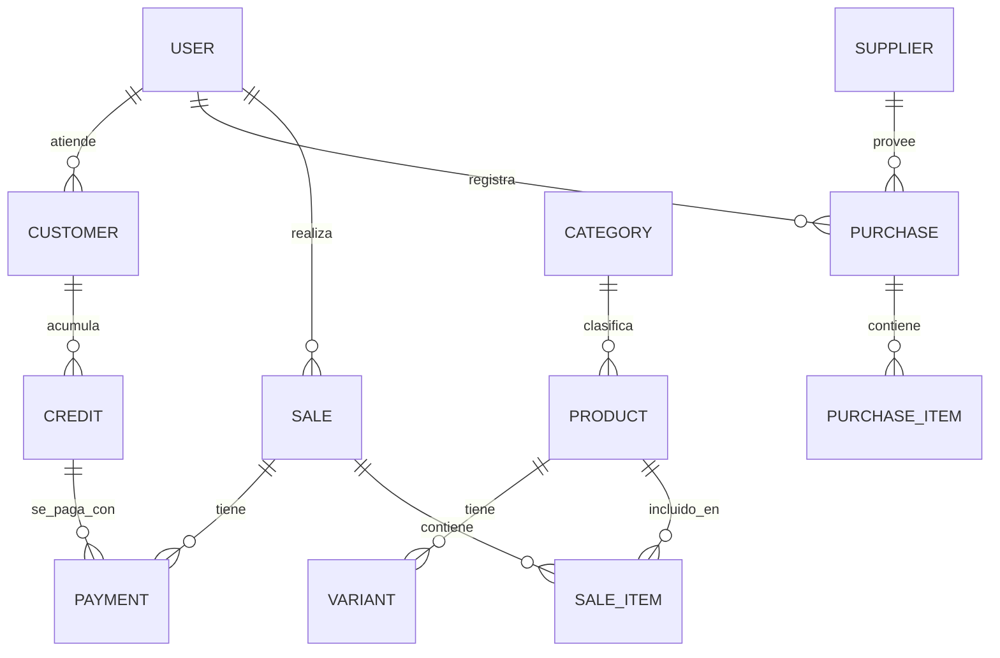

# Estructura del Proyecto Placita

**Última actualización:** 2025-10-05  
**Versión:** 1.0.0

## Visión General

Este documento define la estructura del proyecto Placita, un sistema de gestión integral para el Mercado Modelo La Placita en Posadas, Misiones. El sistema está diseñado para funcionar en dispositivos móviles con soporte offline, centrándose en la rapidez, simplicidad y usabilidad.

## Estructura del Código Fuente

```
placita/
├── .github/                    # Configuración de GitHub (CI/CD, PR templates, etc.)
├── .vscode/                    # Configuración específica de VSCode
├── docker/                     # Configuraciones de Docker
├── docs/                       # Documentación del proyecto
│   ├── api/                    # Documentación de la API
│   ├── arquitectura/           # Diagramas de arquitectura
│   └── guias/                  # Guías para desarrolladores
├── prisma/                     # Esquemas y migraciones de Prisma
├── public/                     # Archivos estáticos
│   ├── fonts/                  # Fuentes personalizadas
│   ├── images/                 # Imágenes globales
│   └── locales/                # Archivos de internacionalización
├── scripts/                    # Scripts de utilidad
├── src/
│   ├── app/                    # Configuración de la aplicación SvelteKit
│   │   ├── hooks/              # Hooks del servidor y cliente
│   │   └── routes/             # Rutas de la aplicación
│   │       ├── (auth)/         # Rutas de autenticación
│   │       ├── (dashboard)/    # Rutas del dashboard
│   │       └── api/            # Endpoints de la API
│   ├── lib/
│   │   ├── components/         # Componentes reutilizables
│   │   │   ├── ui/             # Componentes de UI puros
│   │   │   ├── forms/          # Componentes de formulario
│   │   │   └── layout/         # Componentes de diseño
│   │   ├── config/             # Configuraciones
│   │   ├── constants/          # Constantes de la aplicación
│   │   ├── db/                 # Configuración de la base de datos
│   │   ├── hooks/              # Hooks personalizados
│   │   ├── services/           # Servicios de negocio
│   │   │   ├── api/            # Clientes de API
│   │   │   ├── auth/           # Servicios de autenticación
│   │   │   ├── inventory/      # Gestión de inventario
│   │   │   ├── pos/            # Lógica del punto de venta
│   │   │   └── sync/           # Sincronización offline
│   │   ├── stores/             # Stores de Svelte
│   │   │   ├── auth/           # Estado de autenticación
│   │   │   ├── cart/           # Estado del carrito
│   │   │   └── ui/             # Estado de la interfaz
│   │   ├── types/              # Tipos TypeScript
│   │   └── utils/              # Utilidades
│   └── styles/                 # Estilos globales
│       └── components/         # Estilos específicos de componentes
├── tests/                      # Pruebas automatizadas
│   ├── e2e/                    # Pruebas de extremo a extremo
│   ├── integration/            # Pruebas de integración
│   ├── mocks/                  # Datos de prueba
│   └── unit/                   # Pruebas unitarias
├── .editorconfig               # Configuración del editor
├── .env.example                # Variables de entorno de ejemplo
├── .eslintrc.js                # Configuración de ESLint
├── .gitignore                  # Archivos ignorados por Git
├── .prettierrc                 # Configuración de Prettier
├── Dockerfile                  # Configuración de Docker
├── docker-compose.yml          # Configuración de Docker Compose
├── package.json                # Dependencias y scripts
├── README.md                   # Documentación principal
└── tsconfig.json               # Configuración de TypeScript
```

## Descripción de los Directorios Principales

### 1. `.github/`
- Configuraciones de GitHub Actions para CI/CD
- Plantillas para issues y pull requests
- Configuración de dependabot

### 2. `docker/`
- Configuraciones de Docker para diferentes entornos
- Scripts para construcción y despliegue
- Configuraciones de red y volúmenes

### 3. `docs/`
- Documentación técnica y de usuario
- Diagramas de arquitectura
- Guías de contribución

### 4. `prisma/`
- Esquema de la base de datos
- Migraciones
- Seeds para datos iniciales

### 5. `public/`
- Recursos estáticos
- Imágenes, fuentes y archivos de internacionalización
- Assets compilados

### 6. `src/`
#### `app/`
- Configuración principal de SvelteKit
- Rutas de la aplicación
- Hooks del servidor y cliente

#### `lib/`
- `components/`: Componentes reutilizables organizados por dominio
- `config/`: Configuraciones de la aplicación
- `services/`: Lógica de negocio separada por dominio
- `stores/`: Estado global de la aplicación
- `types/`: Tipos TypeScript compartidos
- `utils/`: Funciones de utilidad

### 7. `tests/`
- Pruebas unitarias, de integración y E2E
- Mocks y datos de prueba
- Configuración de herramientas de testing

## Estructura de la Base de Datos

La base de datos sigue un esquema relacional con las siguientes entidades principales:



## Flujo de Desarrollo

1. **Configuración Inicial**
   ```bash
   # Clonar el repositorio
   git clone https://github.com/tu-usuario/placita.git
   cd placita
   
   # Instalar dependencias
   npm install
   
   # Configurar variables de entorno
   cp .env.example .env
   # Editar .env según sea necesario
   
   # Iniciar base de datos local
   docker-compose up -d postgres
   
   # Aplicar migraciones
   npx prisma migrate dev --name init
   
   # Iniciar servidor de desarrollo
   npm run dev
   ```

2. **Flujo de Trabajo**
   - Crear una rama para la nueva característica: `git checkout -b feature/nombre-caracteristica`
   - Realizar cambios y commits siguiendo el estándar de mensajes
   - Ejecutar pruebas: `npm test`
   - Enviar pull request a la rama `main`
   - Revisión de código y aprobación
   - Merge a `main` con squash

## Estándares de Código

- **TypeScript**: Tipado estricto habilitado
- **Formato**: Prettier con configuración estándar
- **Linting**: ESLint con reglas de Svelte y TypeScript
- **Commits**: Convención de commits convencionales
- **Testing**: 80% de cobertura mínima

## Despliegue

El despliegue se realiza automáticamente a través de GitHub Actions:

1. **Desarrollo**: Despliegue automático a staging en cada push a `develop`
2. **Producción**: Despliegue manual desde `main` con aprobación

## Monitoreo y Observabilidad

- **Logs**: Centralizados en Papertrail
- **Métricas**: Prometheus + Grafana
- **Trazas**: OpenTelemetry para seguimiento distribuido
- **Alertas**: Configuradas en PagerDuty

## Seguridad

- Autenticación JWT con refresh tokens
- CORS configurado estrictamente
- Headers de seguridad habilitados
- Escaneo de dependencias con Dependabot
- Auditorías periódicas de seguridad

## Soporte Offline

- Estrategia de caché con Service Workers
- Cola de operaciones para sincronización diferida
- Resolución de conflictos optimista
- Indicadores de estado de conexión

## Documentación Adicional

- [Arquitectura](./docs/arquitectura/README.md)
- [Guía de Contribución](./docs/guias/CONTRIBUTING.md)
- [API Reference](./docs/api/README.md)
- [Preguntas Frecuentes](./docs/FAQ.md)

---

*Este documento se actualizará según evolucione la arquitectura del proyecto.*